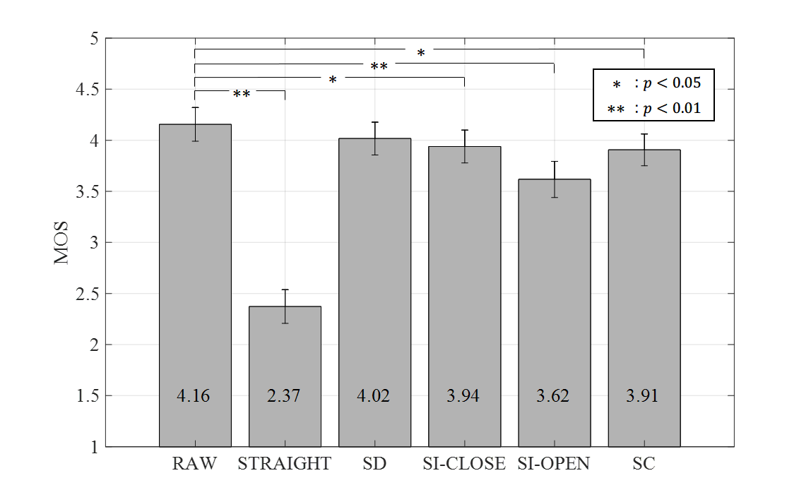

# WaveNet Vocoder Samples


Listen audio samples from here -> [WaveNetVocoderSamples](https://kan-bayashi.github.io/WaveNetVocoderSamples/)

## Audio samples

Audio examples are in `wav/<speaker_name>/<method>/arctic_<utt_id>.wav`

- `<speaker_id>`: the name of speaker in CMU Arctic database
  - `bdl`,` rms`: male speaker
  - `slt`, `clb`: female speaker
- `<method>` : the name of method
  - `raw`: target speech
  - `straight`: the conventional vocoder with F0, straight-melcep, aperiodicity
  - `sd`: the speaker-dependent WaveNet vocoder 
  - `sc_close`: the WaveNet vocoder with speaker-code trained using utterances of all of the speakers
  - `si_close`: the WaveNet vocoder trained using utterances of all of the speakers
  - `si_open`: the WaveNet vocoder trained using utterances of all of the speakers except for evaluation speakers

## Subjective Evaluation Result

- `#evaluation speakers=4`
- `#evaluation utts per speaker=40`
- `#subjects=9`
- `#evaluation utts per subject=120`



## References

```
@article{hayashi2018sp,
  title={複数話者WaveNetボコーダに関する調査}.
  author={林知樹 and 小林和弘 and 玉森聡 and 武田一哉 and 戸田智基},
  journal={電子情報通信学会技術研究報告},
  year={2018}
}
@article{hayashi2017multi,
  title={An Investigation of Multi-Speaker Training for WaveNet Vocoder},
  author={Hayashi, Tomoki and Tamamori, Akira and Kobayashi, Kazuhiro and Takeda, Kazuya and Toda, Tomoki},
  journal={Proc. ASRU 2017},
  year={2017}
}
@inproceedings{tamamori2017speaker,
  title={Speaker-dependent WaveNet vocoder},
  author={Tamamori, Akira and Hayashi, Tomoki and Kobayashi, Kazuhiro and Takeda, Kazuya and Toda, Tomoki},
  booktitle={Proceedings of Interspeech},
  pages={1118--1122},
  year={2017}
}
```

# Contact
Tomoki Hayashi @ Nagoya University  
email: hayashi.tomoki<at>g.sp.m.is.nagoya-u.ac.jp
